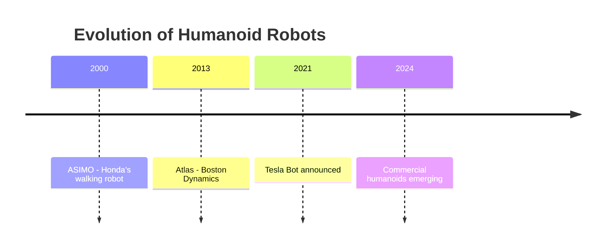

# Chapter 1: Introduction to Physical AI

## What is Physical AI?

Physical AI refers to AI systems that operate in the real world and understand physical laws. Unlike traditional AI that exists only in digital spaces, Physical AI must:

- Perceive the environment through sensors
- Interact with physical objects
- Navigate real-world spaces
- Handle uncertainty and noise

## Key Concepts

### Embodied Intelligence

Embodied intelligence is intelligence that arises from the interaction between an agent's body, brain, and environment.

### Digital AI vs Physical AI

| Aspect | Digital AI | Physical AI |
|--------|-----------|-------------|
| Environment | Virtual | Real World |
| Feedback | Instant | Delayed |
| Constraints | Computational | Physical Laws |
| Safety | Low Stakes | Critical |

## Why Humanoid Robots?

Humanoid robots are designed for human-centered environments:

1. **Compatibility**: Our world is built for humans
2. **Intuitive Interaction**: Humans understand human-like movements
3. **Rich Training Data**: Abundant human activity data
4. **Tool Usage**: Can use existing human tools

## Real-World Applications

### Healthcare
- Patient assistance
- Medicine delivery
- Elderly care

### Manufacturing
- Flexible assembly
- Quality inspection
- Hazardous environments

### Service Industry
- Hotel services
- Restaurant assistance
- Retail support

## Timeline of Humanoid Robotics

## Chapter Summary

- Physical AI bridges digital intelligence and physical world
- Humanoid form is optimal for human environments
- Real-world constraints make robotics challenging
- Multiple industries investing in humanoid technology

## Exercise

Think of 3 daily tasks that would benefit from a humanoid robot. What challenges would the robot face?

---

**Next**: [Chapter 2: Sensor Systems →](chapter-2)