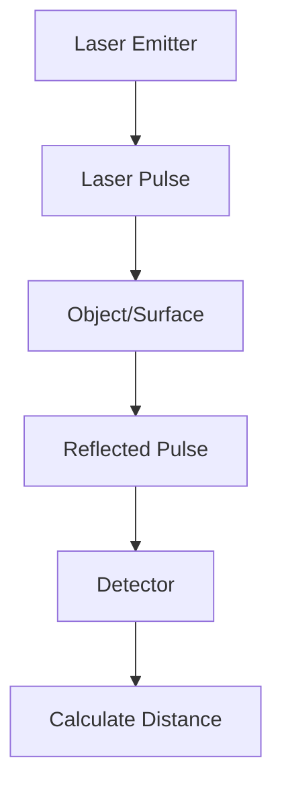
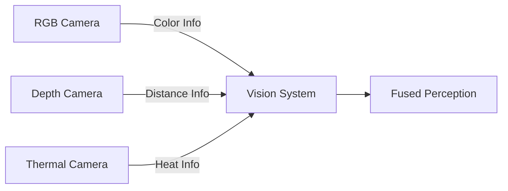
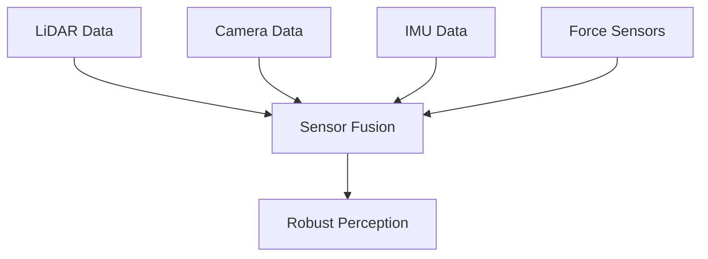
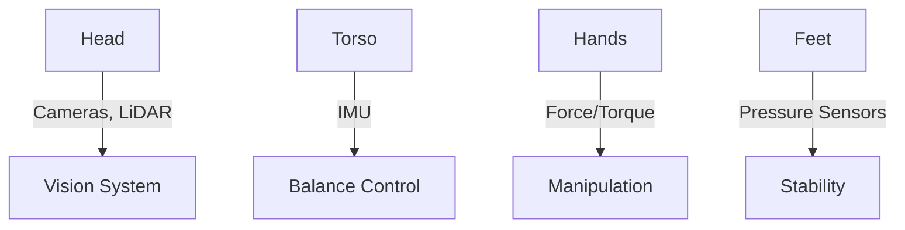

# Chapter 2: Sensor Systems

## Introduction to Robot Perception

Robots perceive the world through sensors. This chapter covers the primary sensor types used in humanoid robotics.

## LiDAR (Light Detection and Ranging)

### How LiDAR Works

LiDAR uses laser pulses to measure distances and create 3D maps of the environment.


### Applications
- Obstacle detection
- 3D mapping (SLAM)
- Navigation planning
- Object recognition

### LiDAR Specifications

| Parameter | Typical Value |
|-----------|--------------|
| Range | 0.1m - 100m |
| Accuracy | ±2cm |
| Scan Rate | 5-20 Hz |
| Angular Resolution | 0.1° - 1° |

## Camera Systems

### RGB Cameras

Standard color cameras for visual perception:
- Object detection
- Face recognition
- Scene understanding

### Depth Cameras

Measure distance to each pixel:
- **Stereo Vision**: Two cameras for depth
- **Structured Light**: Projects patterns
- **Time-of-Flight**: Measures light travel time

### Camera Comparison


## IMU (Inertial Measurement Unit)

### Components

An IMU combines:
1. **Accelerometer**: Measures acceleration (3 axes)
2. **Gyroscope**: Measures rotation rate (3 axes)
3. **Magnetometer**: Measures magnetic field (optional)

### Applications in Robotics

- Balance control
- Orientation estimation
- Fall detection
- Motion tracking

### IMU Data Fusion
```python
# Conceptual IMU data reading
class IMUData:
    def __init__(self):
        self.acceleration = [ax, ay, az]  # m/s²
        self.angular_velocity = [gx, gy, gz]  # rad/s
        self.orientation = [roll, pitch, yaw]  # radians
```

## Force/Torque Sensors

### Purpose

Measure forces and moments applied to robot joints or end-effectors.

### Applications
- Compliant grasping
- Contact detection
- Force-controlled assembly
- Human-robot collaboration safety

## Sensor Fusion

### Why Combine Sensors?

No single sensor provides complete information. Sensor fusion combines multiple sensor inputs:


### Benefits
- **Redundancy**: Backup if one sensor fails
- **Accuracy**: Cross-validation of measurements
- **Completeness**: Different sensors for different aspects

## Sensor Placement on Humanoids


## Chapter Summary

- LiDAR provides accurate 3D mapping
- Cameras enable visual perception
- IMUs track orientation and motion
- Force sensors enable safe interaction
- Sensor fusion combines strengths of each sensor

## Exercise

Design a sensor suite for a humanoid robot working in a warehouse. Which sensors would you prioritize and why?

---

**Next**: [Chapter 3: ROS 2 Architecture →](chapter-3)