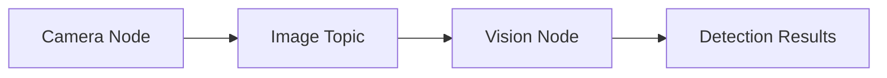
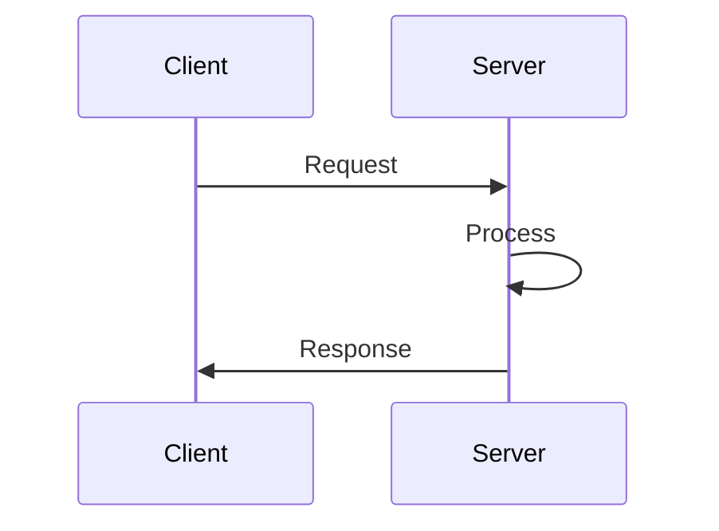
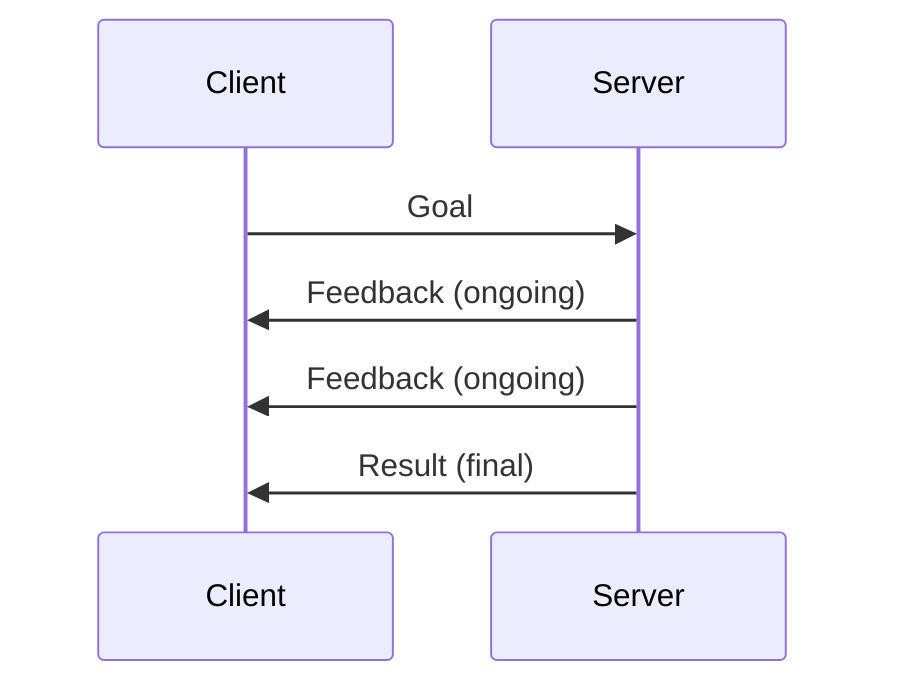
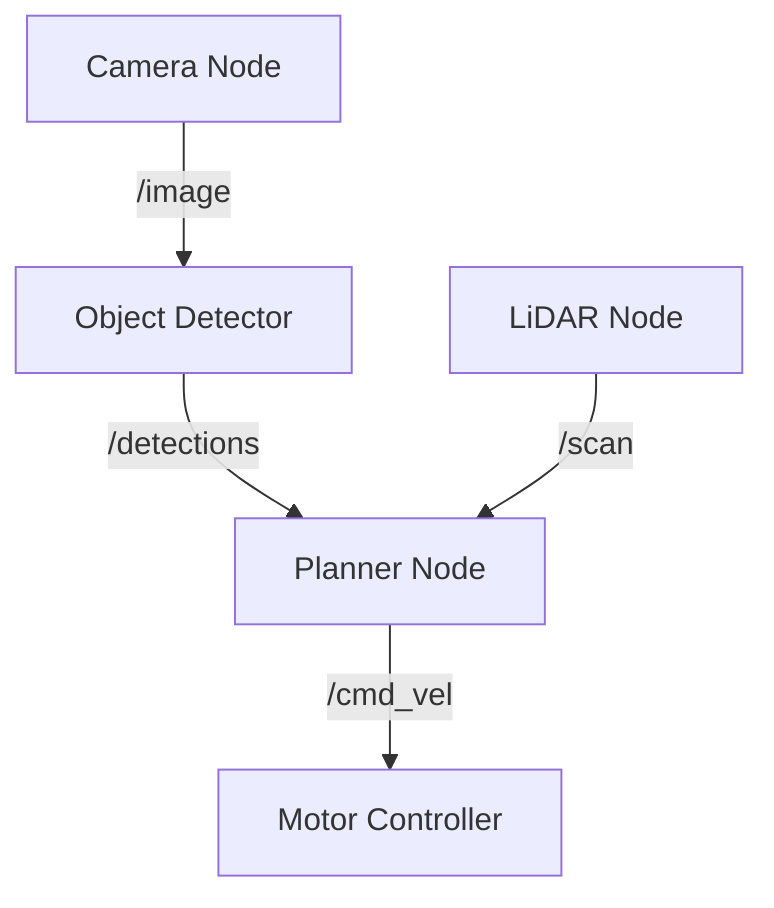
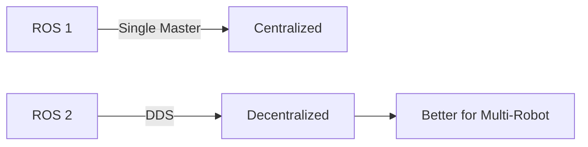
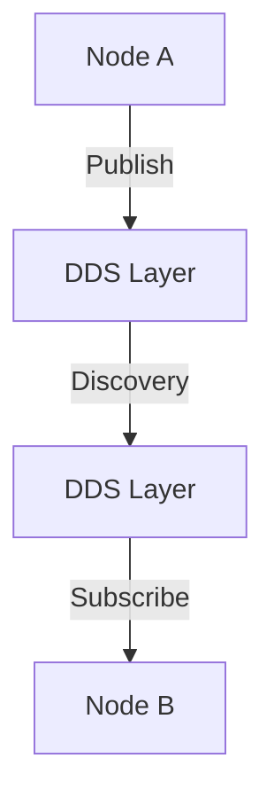

# Chapter 3: ROS 2 Architecture

## What is ROS 2?

ROS 2 (Robot Operating System 2) is middleware that provides:
- Communication infrastructure
- Hardware abstraction
- Package management
- Development tools

## Core Concepts

### Nodes

A **node** is a single executable that performs computation.


### Topics

Topics enable **publish-subscribe** communication:
```python
# Publisher example (conceptual)
publisher = node.create_publisher(topic_name, message_type)
publisher.publish(message)

# Subscriber example (conceptual)
subscriber = node.create_subscription(topic_name, callback_function)
```

### Services

Services provide **request-response** communication:


### Actions

Actions for **long-running tasks** with feedback:


## ROS 2 Graph

The computation graph shows all nodes and their connections:


## Communication Patterns

### Pub/Sub (Topics)

Best for:
- Sensor data streams
- Continuous data flow
- One-to-many communication

### Request/Response (Services)

Best for:
- Occasional operations
- Computation requests
- Configuration changes

### Goal-Oriented (Actions)

Best for:
- Navigation commands
- Long computations
- Cancellable operations

## ROS 2 Distributions

| Distribution | Release Date | Support Until |
|--------------|--------------|---------------|
| Foxy | June 2020 | May 2023 |
| Humble | May 2022 | May 2027 (LTS) |
| Iron | May 2023 | Nov 2024 |

**Recommendation**: Use Humble (Long Term Support)

## ROS 2 vs ROS 1


### Key Improvements in ROS 2
- No single point of failure
- Real-time capable
- Better security
- Multi-platform support (Windows, macOS)
- Improved Python and C++ APIs

## Data Distribution Service (DDS)

ROS 2 uses DDS for communication:


### DDS Benefits
- Automatic discovery
- Quality of Service (QoS) policies
- Reliable data delivery
- Scalable architecture

## Quality of Service (QoS)

QoS policies control communication behavior:

| Policy | Options | Use Case |
|--------|---------|----------|
| Reliability | Reliable, Best Effort | Sensor data vs Commands |
| Durability | Volatile, Transient Local | Temporary vs Persistent |
| History | Keep Last N, Keep All | Buffer size |

## Chapter Summary

- ROS 2 is middleware for robot software
- Nodes communicate via topics, services, actions
- DDS provides robust communication
- QoS policies control data delivery
- Humble is the recommended LTS version

## Exercise

Design a ROS 2 graph for a delivery robot that:
1. Reads camera and LiDAR data
2. Detects obstacles
3. Plans a path
4. Controls motors

Draw the nodes, topics, and data flow.

---

**Next**: [Chapter 4: Python-ROS Integration →](chapter-4)